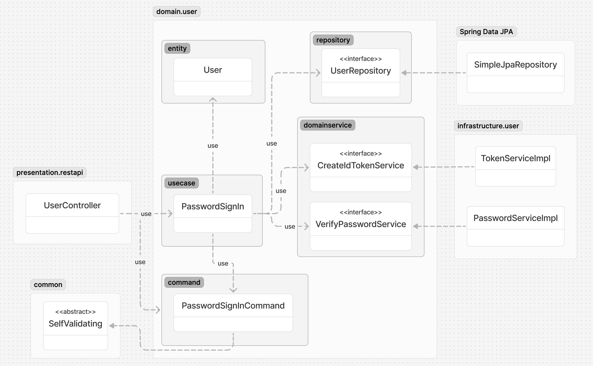

# Commerce Backend

## Description
다양한 백엔드 기술 연습을 위한 토이 프로젝트.
평범한 커머스 사이트를 온전히 구현하는 것을 목표로 한다.

## Tech Stack
- JDK 17
- Spring Boot 3.3.1
- Spring Data JPA & QueryDSL

## Architecture

### common
- 모든 패키지에서 공통적으로 사용할 객체들이 저장되는 곳이다.
- AbstractEntity: 엔티티가 상속하는 클래스이다. 대부분의 엔티티가 필수로 가져야 할 createdAt, updatedAt을 가지고 있다.
- Problem: 비즈니스 로직 수행 중 더이상 처리할 수 없을 때 이 객체를 확장하여 에러 객체를 구현한다. 에러 코드, 에러 메시지, 그리고 에러 종류를 담을 수 있다.
- SelfValidating: 명령 객체를 검증할 때 이 객체를 확장하여 검사한다. jakarta validation 애노테이션이 붙은 필드들을 모두 검사한다.

### domain
- spring, java, jpa, common 모듈에만 의존한다.
- entity: 엔티티이자 도메인 모델이 저장되는 곳이다. 최대한 모든 비즈니스 로직을 도메인 모델로 모아 풍부한 도메인 모델 형태를 지향한다.
- problem: 비즈니스 로직이나 응용 로직을 수행 중 더이상 처리할 수 없는 상황일 때 이곳에 에러를 Category(NOT_FOUND, UNAUTHORIZED, UNPROCESSABLE)와 함께 에러 코드, 에러 메시지를 포함하도록 정의하고 던지도록 합니다.
- repository: 엔티티를 영속하는 저장소에 보관하고, 불러오는 등의 역할을 한다.
  - Repository Interface는 생산성을 위해 기본적으로 JpaRepository를 확장한다.
  - usecase는 Repository Interface에만 의존한다.
  - 복잡한 DB로직이 필요할 경우 Repository가 RepositoryCustom Interface를 확장한다.
    - 구현은 infrastructure에서 한다.
- command: usecase를 호출하기 위해 필요한 명령 객체의 모음이다. 각 명령 객체는 생성 시에 스스로 간단한 유효성 검사(null 여부, 숫자인지)를 진행한다.
- result: usecase의 실행 결과 객체의 모음이다. 도메인 모델을 그대로 넣지 않고 값을 복사하는 방식의 POJO로 구현하여, 원하지 않는 곳에서 도메인 모델이 변경됨을 방지한다.
- domainservice: 도메인 서비스. 비즈니스 로직이나 응용 로직을 수행하는 도중 외부 서비스의 도움이 필요할 때 이곳에 수행할 객체를 interface 형태로 만든다.
  - 응용계층인 usecase에서 해당 interface를 사용하여 기능을 수행한다.
  - infrastructure layer의 객체들이 이곳에 선언된 interface들을 구현한다.
  - **인터페이스 분리 법칙**을 적용하여 하나의 interface는 하나의 method만 가지도록 한다.
- usecase: 응용계층. 객체가 스스로 수행할 수 없는 로직, 예를 들어 객체를 찾거나, 객체의 비즈니스 로직을 호출하는 역할을 한다. 필요하다면 service를 사용하여 목표를 달성하도록 한다.
  - **단일 책임 원칙**을 적용하여 1 class : 1 기능 규칙을 준수한다. (ex. SignIn, SignUp, FindUsers, …)
  - 항상 interface에 의존하고 구현체에 의존하지 않도록 하여 테스트가 쉽고, 원할 때 구현체를 마음대로 변경할 수 있도록 한다. (개방 폐쇄 원칙)
  - **인터페이스 분리 법칙**이 적용되어 각 usecase는 필요한 메서드에만 의존한다. (ex. SignIn -> (VerifyPasswordService, CreateIdTokenService))

### infrastructure
- usecase가 비즈니스 로직 수행 중 외부 서비스의 연동이 필요할 때 이곳에서 domain.service의 interface를 구현한다.
- 고수준 모듈(domain)이 저수준 모듈(infrastructure)에 의존하지 않게 되어 domain layer가 외부 서비스에 영향받지 않게 하고, 테스트가 쉽도록 한다. (**의존성 역전 원칙**) 

### presentation
- domain layer에 의존하여 usecase를 호출하고 그 결과를 반환하는 역할을 담당한다.
- restapi: HTTP Rest Api Controller가 이곳에 구현된다.
  - CommonResponse: usecase의 수행 결과를 담는 객체이다. 성공 시에는 메시지와 데이터를 반환하고, 에러 발생 시에는 domain에서 정의된 Problem 객체를 적절하게 반환한다.
  - ErrorController: 에러 타입에 따라 어떤 CommonResponse를 반환할지 결정하는 곳이다. 도메인 계층에서 Problem이 발생했을 경우 에러 종류에 따라 적절하게 HTTP Status로 변환하는 역할을 한다.
  - security/AuthenticationFilter: Http request 마다 인증 토큰이 포함되어 있는지 확인하고, 있는 경우 토큰을 분석하여 security context에 유저를 할당해 주는 역할을 하고 있습니다. 유저가 할당되면 Controller에서 유저 데이터를 불러올 수 있습니다.